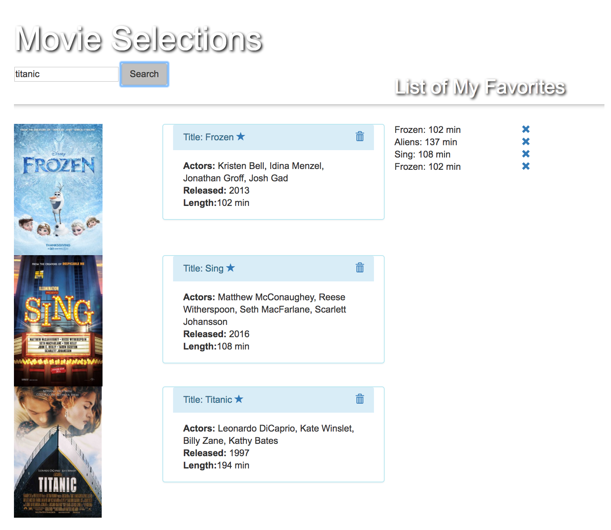

**System Detail**

## Client Side ##
* Displays movie information made available from OMDB.
* submit button that sends the information to OMDB,
* the search information appears as soon as the response returns from the API.
* You MUST use an Angular factory to send the API call ($http).
* 'add to favorites' button on those results.
* When the 'add to favorites' button is clicked, it should record the information for the movie and store it into an array of favorites.
* The other view should display the favorite movies selected by the user.

## Database ##

Hard Mode
* When a favorite is added to the favorites list, store the favorites list in a Mongo Database.
* Add the ability to remove a movie from the Mongo Database, and ensure that the favorites view updates as well.

## Technical Use ##
MEAN stack (Mongo, Express, AngularJS, Bootstrap, and NodeJS), API, Boostrap, CSS3, HTML5

